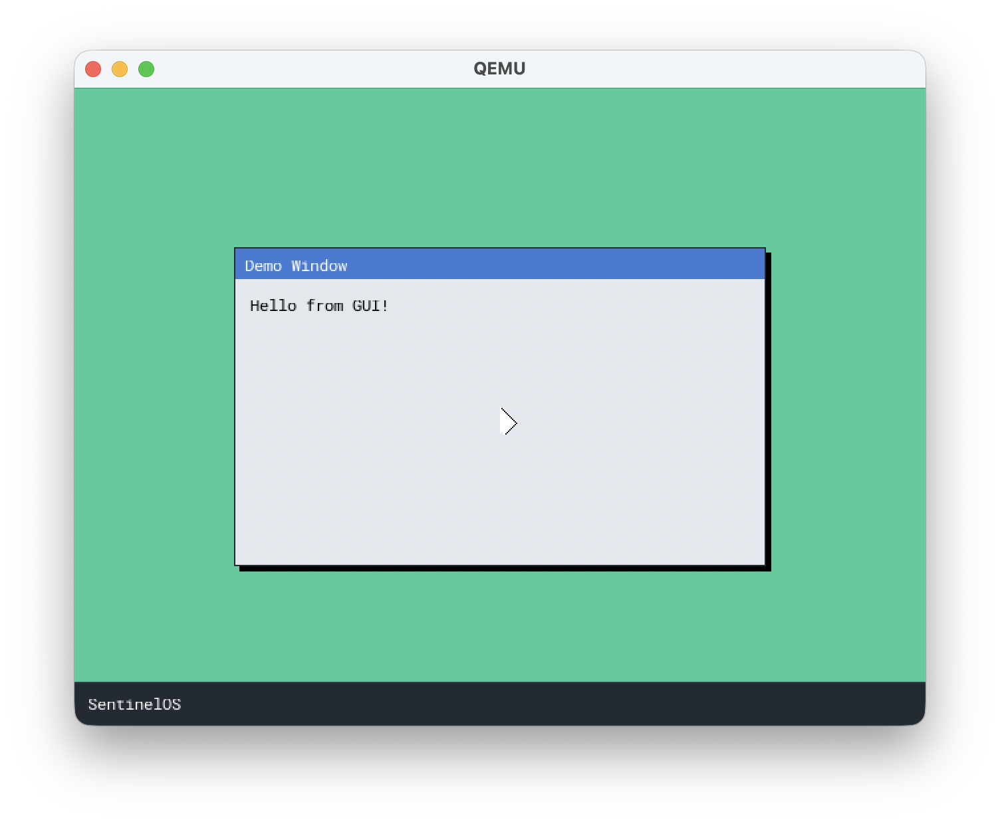

# SentinelOS

SentinelOS is a 64-bit hobby project operating system. The project is implemented in C (cross-compiled with **x86_64-elf-gcc**) and x86-64 assembly and targets virtual machines such as QEMU, it is not recommended to run this in real hardware, unless you know what you are doing

---



---

## Important project status notice

SentinelOS previously booted into a text shell as its primary interface. It is now transitioning to a GUI-first system with a simple desktop, window, and mouse cursor. The shell still exists as a fallback, but graphics and input subsystems are under active development and may change. Expect breaking changes and UI/UX instability while this migration completes.

---

## 1. Feature Overview

* 64-bit long-mode kernel initialised by a Multiboot-2 compliant GRUB bootloader.
* Graphical boot splash rendered with the in-tree *SpringIntoView* immediate-mode framebuffer library.
* Full interrupt infrastructure (IDT, custom ISRs, PIC remap).
* Serial logging on COM1 for non-intrusive debugging (`-serial stdio`).
* Bitmap-based Physical Memory Manager (PMM) and free-list Kernel Heap allocator.
* Virtual File System (VFS) backed by an **initrd** (`initrd.tar`).
* Shell with inline editing & command history supporting:
* `help`, `clear`, `info`, `ls`, `cat`, `mkdir`, `touch`, `rm`, `cd`, `pwd`, `meminfo`, `heapinfo`, `vbeinfo`, `savefs`, `beep`.
* PS/2 keyboard and mouse drivers.
* Sound System **NEW**


---

## 2. System Requirements

| Component | Version / Remark |
|-----------|------------------|
| **Compiler** | `x86_64-elf-gcc` 10.x or newer |
| **Assembler** | `nasm` |
| **Build tools** | `make`, `xorriso`, `grub-mkrescue` |
| **Emulator** | `qemu-system-x86_64` (recommended) |

A pre-built cross-compiler is available via **Homebrew** (macOS) or most Linux distributions. Detailed instructions can be found in `docs/toolchain.md`.

---

## 3. Building the Project

```bash
# Clone repository
$ git clone https://github.com/your-account/SentinelOS.git
$ cd SentinelOS

# Produce bootloader, kernel and ISO image
$ make
```

The build generates `sentinelos.iso` in the project root.

---

## 4. Running under QEMU

Starting command:
```bash
$ qemu-system-x86_64 -accel tcg -m 1024 -cdrom sentinelos.iso -vga virtio -display default -serial stdio
```


If your QEMU does not support `-audiodev`/`pcspk-audiodev`, upgrade QEMU. The legacy `-soundhw pcspk` option is removed in newer versions.

Parameter summary

| Flag | Purpose |
|------|---------|
| `-cdrom` | Attach generated ISO file |
| `-m` | Allocate guest memory (256 MiB is sufficient) |
| `-serial stdio` | Redirect COM1 to the host terminal |
| `-vga std` | 32-bit colour framebuffer compatible with SpringIntoView |

---

## 5. Command Reference

| Command | Description |
|---------|-------------|
| `help` | List available commands |
| `clear` | Clear screen |
| `info` | Display project and version information |
| `ls [path]` | List directory contents |
| `cat <file>` | Show file contents |
| `mkdir <dir>` | Create directory |
| `touch <file>` | Create empty file |
| `rm <file>` | Delete file |
| `cd <dir>` / `pwd` | Navigate virtual file system |
| `meminfo` / `heapinfo` | Memory statistics |
| `vbeinfo` | VESA framebuffer mode information |
| `savefs` | Stream current VFS as a TAR archive over serial |
| `beep [freq] [ms]` | Play PC speaker tone (defaults: 1000 Hz, 200 ms) |

---

## 6. Libraries

- **stb_truetype.h** - Public domain font rendering library
- **minimp3** - Minimalistic MP3 decoder by Lieff, used for audio playback. Licensed under CC0-1.0. See the upstream project and license: [lieff/minimp3](https://github.com/lieff/minimp3) · [CC0-1.0 text](https://github.com/lieff/minimp3?tab=CC0-1.0-1-ov-file)

## 7. License

This project is licensed under the MIT License. See the `LICENSE` file for details.

This repository bundles third‑party components under their own terms:

- `libs/minimp3.h`, `libs/minimp3_ex.h`: CC0-1.0 (see upstream: [lieff/minimp3](https://github.com/lieff/minimp3) · [CC0-1.0 text](https://github.com/lieff/minimp3?tab=CC0-1.0-1-ov-file)).
- `SpringIntoView/stb_truetype_impl.c` and `libs/stb_truetype.h`: public domain (stb).
